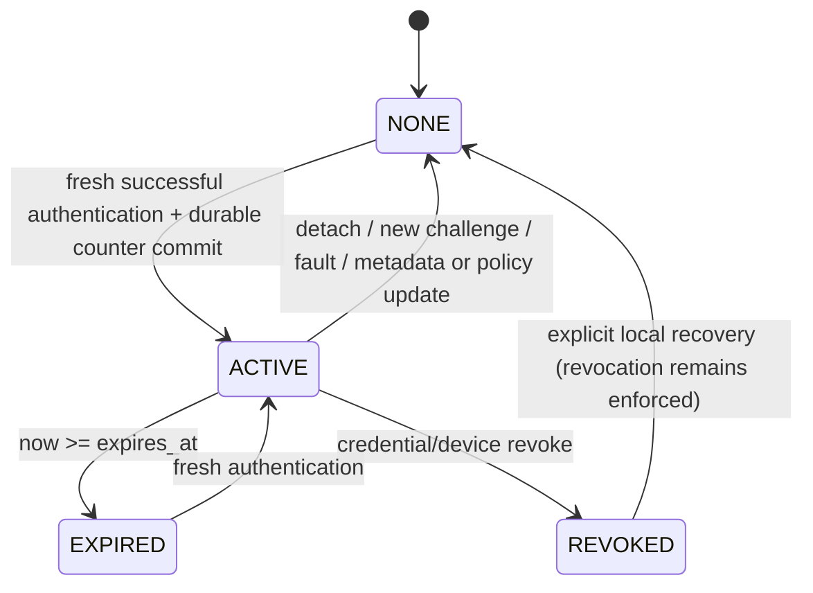

# Session model

A successful authenticated response creates:

| Field | Source |
|---|---|
| session_id | 32 CSPRNG bytes; Python represents them as 64 hex characters |
| credential_id | verified response matched to local metadata |
| operator_id | trusted credential metadata |
| ptt_device_id | verifier's own configured device identity |
| created_at | monotonic milliseconds |
| expires_at | created_at + configured session_timeout_ms |
| policy_version | current accepted policy version |

The ID is an internal handle, not a transferable bearer token. No import/resume
endpoint accepts a session from another PTT. Session lookup requires the exact
locally held ID, device and credential. The policy additionally checks operator,
credential, device and policy binding each time it decides TX.

`SESSION_TIMEOUT_MS` / `session_timeout_ms` defaults to 5000 only as a PoC
experiment parameter. It is independent of v0.1's 1500ms presence grace period.
The v0.2 session has a fixed absolute lifetime and is not renewed by UID presence,
PTT state, status reads or a timer. Credential removal invalidates it immediately
when removal is observed; v0.2 has no implicit presence grace.

For creation at t=0 with timeout 5000:

| Time | Session | Held PTT |
|---|---|---|
| 4999 ms | ACTIVE | eligible for ALLOW_TX |
| 5000 ms | EXPIRED | TX disabled |
| 5001 ms | EXPIRED | TX disabled |

Expiry erases authentication/session material and emits `SESSION_EXPIRED` once.
A system fault clears both session and pending challenge. Recovery reloads public
persistent state and requires a new challenge-response, even if PTT remains held.
A later explicit successful authentication may permit a still-held PTT; that is
the retained level-trigger behavior, not automatic session restoration.

Time is virtual in Python and 64-bit `esp_timer_get_time()/1000` in secure
firmware. The original 32-bit unsigned debounce arithmetic remains for the button.
Expiry is enforced at every policy evaluation, including status reads. The GPIO
changes on the servicing loop; physical scheduling/transport delay is not a
measured zero-latency guarantee. A selected hardware NFC driver must have bounded
or asynchronous I/O so polling does not hold TX across a deadline. Hardware
measurement is TBD; the mock/native boundary tests test the exact logical rule.
