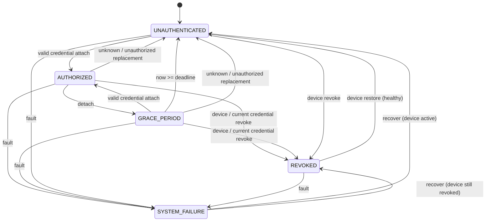

# State Machine

상태는 `AuthState`, `PttState`, `TxDecision`으로 구분한다. 인증이 AUTHORIZED여도
PTT가 RELEASED라면 TX는 비활성화된다.



다이어그램은 주요 전이다. 아래 규칙이 중첩 상태와 자기 전이를 정의한다.

| Event | 전이와 규칙 |
|---|---|
| 정상 Credential attach | healthy이며 device active이고 해당 Credential이 authorized/not revoked일 때만 AUTHORIZED, session valid |
| 미등록/비허용 attach | 이전 세션과 deadline 제거, UNAUTHENTICATED; 해당 거부 사유 유지 |
| 철회된 Credential attach | REVOKED, session invalid |
| 정상 인증 detach | GRACE_PERIOD, deadline = 현재 시각 + grace 설정 |
| 이미 분리된 상태의 detach | no-op; deadline 연장 금지 |
| grace 만료 | UNAUTHENTICATED, session invalid, DENY_CREDENTIAL_EXPIRED |
| 장치 revoke | 활성 세션 즉시 무효화; healthy면 REVOKED, 장애 중이면 SYSTEM_FAILURE 우선 |
| 현재 Credential revoke | 부착 상태와 grace 모두 즉시 무효화, healthy/active이면 REVOKED |
| 다른 Credential revoke | 해당 등록 항목만 철회, 현재 세션은 유지 |
| device restore | device flag 해제, session invalid 유지; 장애 flag는 해제하지 않음 |
| system fault | 모든 상태에서 SYSTEM_FAILURE, session invalid; TX deny |
| system recover | healthy 복귀, session invalid; device revoked면 REVOKED 유지 |
| system reboot | healthy, 부착 정보/세션/deadline 초기화, PTT RELEASED, TX deny; 장치 철회는 유지 |

## TX decision과 우선순위

정책은 위에서 먼저 해당하는 거부 사유를 반환한다.

1. 시스템 unhealthy 또는 SYSTEM_FAILURE → `DENY_SYSTEM_FAILURE`
2. 장치 revoked → `DENY_DEVICE_REVOKED`
3. 현재 세션/부착 Credential revoked → `DENY_CREDENTIAL_REVOKED`
4. Credential authorized가 false → `DENY_CREDENTIAL_UNAUTHORIZED`
5. 인증 불가 → `DENY_NO_CREDENTIAL`, `DENY_UNKNOWN_CREDENTIAL`,
   `DENY_CREDENTIAL_EXPIRED`, `DENY_REAUTHENTICATION_REQUIRED` 등 저장된 원인
6. session 무효, 모순된 상태/ID/deadline, 알 수 없는 값 → 거부
7. grace에서 `now_ms >= deadline` → `DENY_CREDENTIAL_EXPIRED`
8. PTT released → `DENY_PTT_RELEASED`
9. 모든 조건 충족 → `ALLOW`

유효 인증 세션의 필수 조건은 등록 Credential이 있고 authorized/not revoked이며,
AUTHORIZED에서는 부착 ID가 세션 Credential과 일치하고 deadline이 없어야 한다.
GRACE_PERIOD에서는 분리 상태이며 아직 지나지 않은 deadline이 있어야 한다.

## PTT 및 자동 TX 갱신

RELEASED → PRESSED에서 정책을 평가하고, PRESSED → RELEASED에서는 TX를 끈다.
중복 press/release는 no-op이다. 인증 상태를 바꾸는 모든 유효 명령은 TX를
재평가한다. 따라서 다음 명령 없이도 revoke/fault/시간 전진 결과가 TX에 반영된다.

```text
t=0     attach → press → TX ALLOW
t=0     detach → GRACE_PERIOD, PTT PRESSED, TX ALLOW
t=1499  time advance 1499 → TX ALLOW
t=1500  time advance 1 → EXPIRED, PTT PRESSED, TX DENY
```

PTT가 계속 눌린 상태에서 정상 Credential을 재제시하면 TX는 재인증 후 다시
허용될 수 있다. 제품에서 release-before-rearm을 요구할지는 후속 정책 과제다.
장치 restore와 system recover 자체는 이전 세션을 복구하지 않는다.

## 초기/재부팅 상태

새 시뮬레이션은 healthy/active, UNAUTHENTICATED, PTT RELEASED,
DENY_NO_CREDENTIAL, t=0이다. 일반 재부팅도 이 인증/PTT 상태로 돌아가되 시계와
이벤트는 보존한다. 장치가 철회되었다면 재부팅 후 REVOKED/DENY_DEVICE_REVOKED가
우선한다. 재부팅으로 철회 정책을 우회할 수 없다.

