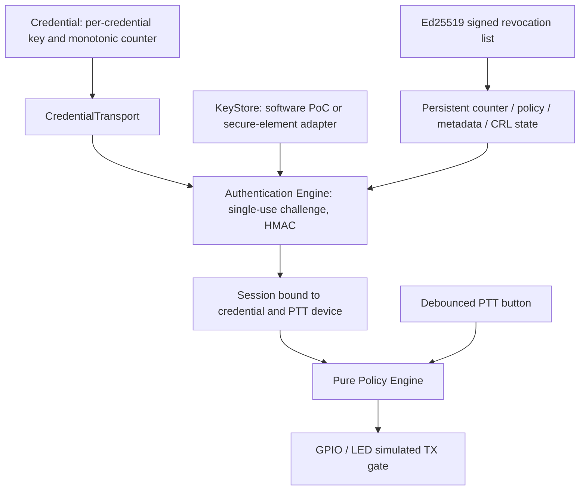

# HERMES v0.2 Security PoC architecture

## Scope and existing structure

Before changes, `hermes-poc/firmware` contained Arduino ESP32-S3 `main.cpp`,
`NfcAuth`, `PttController`, pin/time configuration and a UID example.
`hermes-simulator` contained an identical firmware tree plus a Python package:
models, pure policy, state machine, virtual clock, events, scenario runner and CLI.
Its 97 tests and five scenarios covered v0.1 UID authorization, grace expiry,
PTT, revocation and fault recovery. No cryptographic authentication existed.

v0.2 provides the reference security protocol and state machine in Python and
portable C++. The C++ core is also compiled into ESP32 firmware. It is a Security
PoC, not a production security claim or a proof of the human operator's identity.

## Components and trust boundaries

| Boundary | Python reference | Firmware / portable C++ |
|---|---|---|
| Protocol and key verification | `security/crypto.py` | `lib/hermes_security/src/crypto_backend.cpp` |
| State and policy | `security/engine.py`, `security/models.py` | `hermes_security.cpp`, `hermes_security.h` |
| Signed CRL | `security/revocation.py` | `revocationPayload`, `applyRevocationList` |
| Persistence | `MemoryStore`, `FileStore` | `MemoryStateStore`, `NvsStateStore` |
| Credential transport | `MockCredentialTransport` | `CredentialTransport`, `PN532Transport`, mock |
| Hardware output | boolean simulation only | original `PttController`, `updateSecurity` |
| Legacy path | `legacy_simulator`, `legacy_cli` | explicit `uid-poc` environment |

The default CLI and default firmware are secure. A plain UID never creates a
secure session. PN532 initialization and UID discovery moved to
`credential_transport.*`; legacy matching/grace logic still uses that transport.
The authentication engine has no PN532 dependency.

### Hardware availability is explicit

The shipped default firmware is **unprovisioned and fail-closed**: the secure
element adapter returns an error, the production CRL trust anchor is absent,
and no secure-card application/driver has been selected. `PN532Transport.respond`
returns failure; a normal UID tag cannot implement HMAC authentication.
The PN532 UID driver is real; the secure NFC exchange is an adapter boundary.
This prevents presenting a mock response as real secure-NFC authentication.

`secure-mock` compiles test-only keys from `firmware/test/fixtures` and executes
real HMAC, counters, sessions and policy with a software credential, driven by
serial `a` (authenticate), `d` (detach), `f` (fault), `r` (recover) and the existing
physical PTT button. No authentication renews automatically on a timer.
Its memory stores reset at reboot. The default environment does not include
these fixture keys. Host tests exercise the same C++ engine and actual
`PttController` using fake GPIO; ESP32 execution itself requires a board.

## Policy and fault behavior

`SecurityContext` includes health, device/credential status, authentication,
binding, counter freshness, session state/binding/deadline, PTT and mode.
`evaluate` returns a typed decision, never a boolean. Only `ALLOW_TX` enables
the mock gate. All deny decisions and `ALLOW_EMERGENCY_ONLY` keep it LOW.

- NORMAL needs every security gate and held PTT.
- DEGRADED requires explicit versioned policy configuration. Without the
  additional `emergency_enabled` flag it denies. With it, healthy, non-revoked
  state and held PTT can return `ALLOW_EMERGENCY_ONLY`; no emergency RF exists.
- REVOKED denies all normal TX. System/storage/signature faults and explicit
  revocation still override emergency representation.
- Faults erase session and pending challenge. Recovery reloads persistent state
  and requires fresh authentication; it never restores an old session.
- Updates to active credential metadata or policy invalidate its session.
  Signed revocation immediately invalidates matching active sessions.
- Rollback attempts invalidate authorization and latch an administrative fault
  until explicit local recovery. A new authentication cannot clear it.

All administrative update APIs are trusted local control operations in this
PoC. Policy and credential metadata do not have remote signed distribution.
There is no cloud, network control plane or authorization bypass command.

## Trace and parity

Both implementations emit `timestamp_ms`, `event`, `device_id`, `credential_id`,
`reason`. Absent identifiers/reasons are Python null or firmware empty string.
Events include challenge, success, MAC failure, replay, counter rollback,
binding failure, session creation/expiry, credential/device revoke, CRL update,
signature failure, policy rollback, system fault and TX allowed/denied.
No key, complete MAC transcript or session token is logged.

`tools/validate_security.py` compares nine golden decisions with native C++.
Shared protocol and CRL vectors verify byte encoding and standard crypto.
This is host parity, not measured firmware timing parity.
